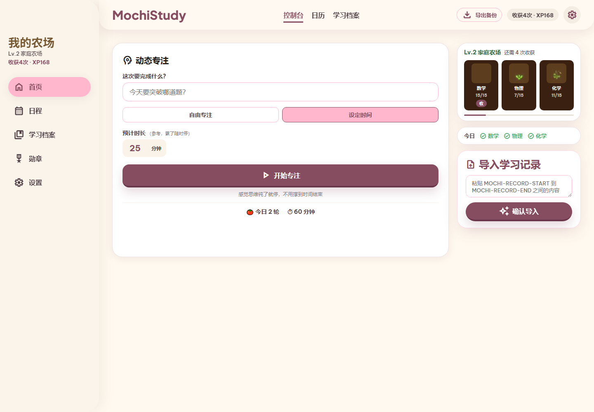
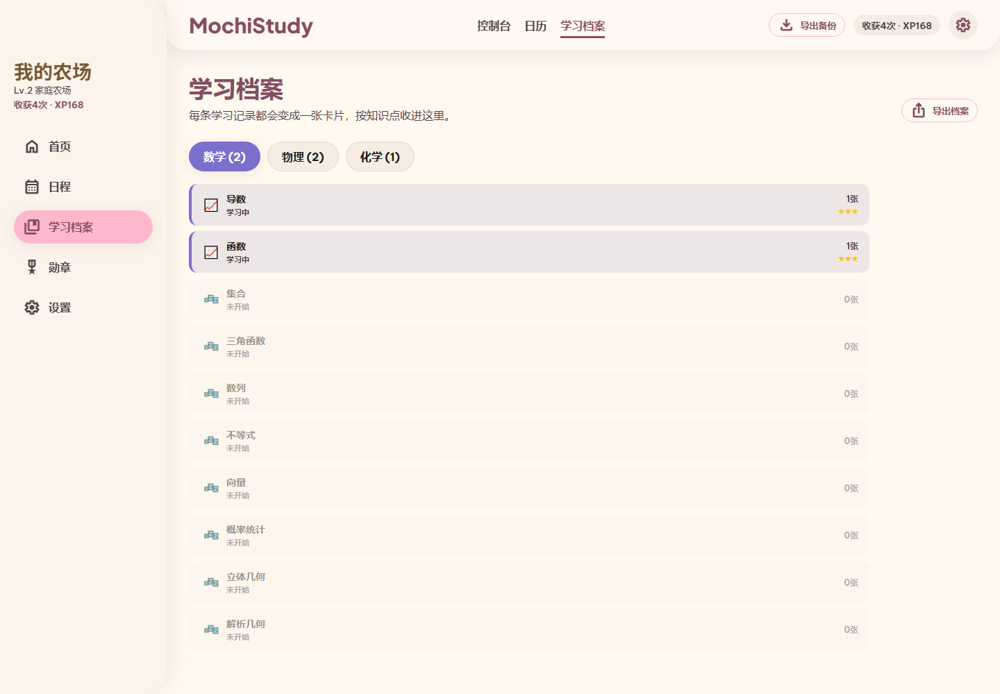
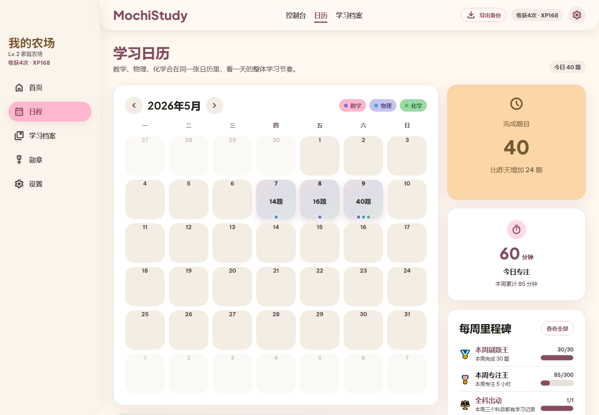
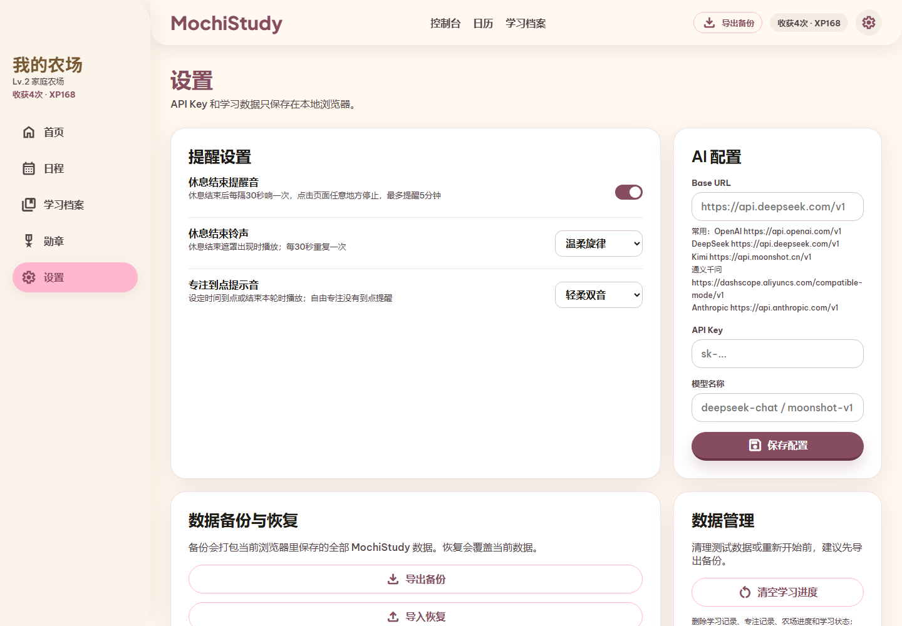

# MochiStudy

一个给高中生假期学习用的本地优先学习记录网站。它把“今天做了什么题、卡在哪里、有没有复习、专注了多久”这些很容易散掉的信息，整理成可以看见的学习档案、日历、勋章和一座会慢慢长大的小农场。

> 目标不是做一个复杂的学习系统，而是让基础薄弱、容易没信心的学生每天愿意多记录一点、多坚持一会儿。

## 画面预览

### 首页：专注计时 + 三科农场 + 今日记录



### 学习档案：每条学习记录都会沉淀成卡片



### 学习日历：把题量、专注和复盘放回日期里



### 设置页：本地备份、提醒音和 AI 导入配置



## 它解决什么问题

很多学生不是完全不学，而是学完之后没有留下清晰痕迹：

- 今天做了题，但过两天忘了自己卡在哪里
- 错题很多，但不知道哪些知识点反复出现
- 学习很容易变成“熬时间”，缺少及时反馈
- 放假期间节奏容易断，一断就觉得自己又失败了

MochiStudy 的设计思路是：把学习记录做得足够轻，把反馈做得足够具体。学生只要导入一条记录，就能看到学习档案更新、农场地块成长、日历留下痕迹，慢慢形成“我确实在推进”的感觉。

## 核心亮点

MochiStudy 最重要的设计不是“记录很多数据”，而是把零散学习记录整理成 **AI 可以继续使用的学习材料**：

- 暑假物理首页有 28 天滚动任务：未完成自动顺延，提前完成自动解锁下一组
- 每个视频节点按“例题截图 → 同类测验包 → 本节收尾”推进；收尾只要求选当前做题状态、写一句下次提醒，保存后节点才变绿
- 例题截图粘贴成功后会自动保存到本机浏览器；“从文件添加”只是粘贴不方便时的备用入口，不上传到 GitHub
- 复制测验包/例题图片后，当前视频下方会出现 MOCHI-RECORD 粘回入口，右下角也会提示“等待导入”
- 专注计时可以收起成右下角小窗，计时继续跑；暑假任务的专注结果回到“本节收尾”，普通专注保留轻量小结
- `MOCHI-RECORD` 统一从页面导入框归档，不再让每个视频卡片都塞一个导入按钮
- 每条学习记录都会变成一张学习卡片
- 每张卡片保留日期、题数、星级、卡点和解题套路
- 导出档案时可以选择摘要、详细记录、AI复习包或 JSON
- 摘要适合做整体学习诊断
- 详细记录适合让 AI 按卡点出题、安排复习、追踪同一知识点的变化
- AI复习包适合复制给复习 AI 私教，针对某科或全部科目生成复习测验
- 复习页会按知识点列出今日建议，点“开始复习”可复制单知识点复习包，并把复习 AI 输出回填导入
- 首页会露出一张“今日复习”卡片，学生不用先进入后台式列表，也能直接开始当天最该处理的一项
- JSON 适合后续自动化分析或二次开发

这让学生不是简单地“打卡完成”，而是留下可复盘、可分析、可继续生成学习计划的材料。

## 设计原则和完整工作流

MochiStudy 的第一性原理是：**降低记录阻力，把学习痕迹变成下一次 AI 辅导可以继续使用的材料。** 网站本身不应该变成复杂题库，也不应该抢走学生的注意力；它要做的是收集、整理、提醒和导出。

### 三个角色

1. **高考 AI 私教**
   学生遇到不会的新题时使用。它负责引导解题、当堂变式，最后输出一段 `MOCHI-RECORD`。

2. **MochiStudy 学习网站**
   它是学习痕迹数据库。学生只需要把 `MOCHI-RECORD` 粘进来，网站把记录沉淀成学习卡片、农场成长、日历痕迹和可导出的 AI 素材。

3. **高考复习 AI 私教**
   它不从零讲新题，而是读取网站导出的“AI复习包”，选择旧卡点做复习测验。复习结束后也输出新的 `MOCHI-RECORD`，再回到网站里形成复习卡片。

### 闭环

```text
不会的新题
  → 高考 AI 私教
  → 输出 MOCHI-RECORD
  → MochiStudy 导入成“新题讲解”卡
  → 导出某科/全部“AI复习包”
  → 高考复习 AI 私教生成复习测验
  → 输出增强版 MOCHI-RECORD
  → MochiStudy 导入成“复习测验”卡
  → 同一知识点下看到学习是否真的变好
```

### 模块职责

- 首页：完成今天的学习输入和专注启动，降低开始成本。
- 学习档案：按科目和知识点沉淀卡片，是“AI 可用学习材料”的主仓库。
- 复习：按本地规则显示今天最该复习的知识点，提供“开始复习 → 回填导入”的闭环。
- 学习日历：按日期回看题量、专注和节奏，帮助发现断档。
- 农场和勋章：只做轻量反馈，不引入复杂资源系统。
- 设置：备份恢复、提醒音和 API 预留配置，不是主要学习入口。
- Skill 文件：定义外部 AI 家教怎样讲题、怎样复习、怎样输出网站可识别记录。

### 复习模块

`#review` 复习页服务于“不主动复习”的学生，而不是做成复杂的管理后台。它的第一版是本地规则驱动的复习指挥台：

- 显示今日最该复习的 1-2 个知识点，而不是让学生自己翻档案。
- 每个知识点行显示：最近学习时间、低星次数、复习次数、上次复习结果。
- 每行提供“开始复习”按钮，自动复制这个知识点的 AI复习包，并展开回填框。
- 点“开始复习”不算完成；只有把复习 AI 输出的 `MOCHI-RECORD` 粘回这一行并成功导入，才算完成一次复习。
- 复习后按结果进入“待巩固 / 近期稳定”等冷却状态，避免学生感觉怎么复习都复习不完。
- 学习档案前台默认只强调“新学 / 复习”，内部仍保留更细来源用于导出和后续分析。
- 学习档案展开知识点时先显示规则型核心摘要，历史卡片默认折叠，让旧记录逐步变成更薄的复习材料。
- 核心摘要来自已有字段和本地复习状态，不依赖 API；它负责整理，不负责像老师一样重新理解题目。
- 未来可接入 API 自动生成复习建议，但第一版仍应保留手动复制工作流。
- 复习记录导入后仍回到原知识点下，通过“复习测验 / 小测验 / 阶段复盘”标签区分，不另开孤立档案。
- 复习导入成功后会提醒“去更新核心摘要”，把这次真正有价值的一句话沉淀到学习档案。
- 学习档案提供“整理模式”：默认隐藏摘要编辑、卡片编辑、删除和拖拽，只有需要整理时才打开。
- 复习算法集中在 `modules/reviewEngine.js`，设计说明见 `docs/review-module.md`。

## 主要功能

### 1. 学习记录导入

每条记录包含：

- 科目：数学 / 物理 / 化学
- 知识点：来自固定预设列表
- 完成题数
- 星级评价
- 卡点一句话
- 今日套路，记录解题步骤
- 日期

这些记录会写入 `localStorage["study_log"]`，是整个网站最核心的数据。

### 2. 学习档案

旧的“知识地图”被改成了更适合复盘的“学习档案”：

- 按科目分 Tab
- 每个知识点是一组
- 每条学习记录变成一张卡片
- 卡片正面突出“卡点”
- 展开后能看到“今日套路”
- 复习 AI 输出的记录会回到同一个知识点下，显示为“复习测验 / 小测验 / 阶段复盘”
- 可选保存复习结果、错误类型、卡住步骤、关键突破、题型标签、信心分和耗时
- 支持导出档案，方便以后复盘或给 AI 分析

导出档案支持四种格式：

| 格式 | 适合用途 | 内容特点 |
| --- | --- | --- |
| 摘要 | 给 AI 做整体学习诊断 | 按科目和知识点汇总学习次数、状态、星级轨迹、历史卡点和最近套路 |
| 详细记录 | 给 AI 针对卡点出题或制定复习计划 | 逐张卡片完整导出日期、星级、题数、卡点、原题、套路和复习元信息 |
| AI复习包 | 给复习 AI 私教生成测验 | 包含学生画像、待复习优先级、历史卡点、复习结果和 MOCHI-RECORD 回写要求 |
| JSON | 开发和自动化处理 | 结构化输出科目、知识点、逐条记录、星级、卡点、原题、套路和 meta |

详细记录示例：

```text
━━━━━━━━━━━━━━━━━━━━ 数学 ━━━━━━━━━━━━━━━━━━━━

【导数】共 2 次
  第1次 | 2026-05-07 | ★★★ | 10题
  卡点：无（这次全部掌握）
  套路：先看定义域
        再算导数

  第2次 | 2026-05-09 | ★★☆ | 12题
  卡点：切线方程参数容易乱
  套路：1. 先求导
        2. 代切点
        3. 回代检查
```

这份导出可以直接复制给 AI，例如让它做：

- 找出反复出现的卡点
- 根据某个知识点的多张卡片判断进步情况
- 为薄弱知识点生成下一轮练习任务
- 把“今日套路”整理成复习提醒
- 制定未来 7 天的复习计划

项目内还提供 `skill/gaokao复习私教.md`。工作流是：从学习档案导出“AI复习包” → 粘贴给复习 AI → AI 出一题复习测验并引导完成 → 最后输出新的 `MOCHI-RECORD` → 再导入 MochiStudy，形成复习卡片。

### 3. 动态专注计时

首页单列布局中有一个可折叠的番茄钟区域：

- 默认自由专注（无倒计时，记录累计时长）
- 也可切换到设定时间模式
- 专注开始后进入沉浸模式
- 中途可以选择“我累了，现在休息”
- 专注结束后会根据时长给出鼓励语
- 休息结束可以显示遮罩和提醒音

提醒音不是固定死的，设置页可以选择：

- 专注结束提示音：不响 / 轻柔双音 / 小风铃 / 清脆短音
- 休息结束铃声：温柔旋律 / 小风铃 / 低柔三音 / 清亮提示

### 4. 三科农场

农场不是手动种地游戏，而是跟学习记录绑定：

- 数学、物理、化学固定三块地
- 每导入一条对应科目的学习记录，该科地块成长一次
- 15 条记录后作物成熟，可以收获
- 收获次数推动农场升级
- 没有金币、种子、水桶、肥料等复杂资源

这样农场不会抢走学习本身的注意力，只作为可视化奖励存在。

### 5. 勋章和学习日历

勋章会根据真实学习数据计算，例如：

- 累计刷题数
- 点亮知识点数
- 精通知识点数
- 专注总时长
- 连续学习天数
- 三科均衡学习
- 农场收获进度

学习日历则把每日题量、专注记录和当天学习内容放在一起，方便回看一段时间内的节奏。

### 6. 数据备份与恢复

所有数据都保存在浏览器本地，没有后端服务。

设置页提供：

- 导出备份
- 导入恢复
- 清空学习进度，删除学习记录、专注记录、农场进度和学习状态，但保留设置
- 恢复出厂设置，删除当前浏览器里的全部已知 MochiStudy 数据和设置

备份文件是 JSON，包含学习记录、农场状态、专注记录、假期设置、提醒设置等数据。导入前会确认，避免误覆盖当前数据。

## 技术栈

- 原生 HTML
- 原生 CSS
- 原生 JavaScript
- 浏览器 `localStorage`
- 无框架
- 无后端

直接打开 `index.html` 就能使用。

## 调试模式

访问：

```text
index.html?debug=1
```

右下角会出现调试面板，可以快速调整：

- 三科地块成长阶段
- 农场收获次数
- 游戏参数配置
- 番茄钟默认时长
- 卡片判定参数
- 日历热力图阈值

## 数据说明

主要 localStorage key：

```text
study_log
farm_state
mochi_state
focus_log
school_holidays
holiday_mode_override
game_config
card_order
study_card_meta
study_node_summary
sound_reminder_enabled
focus_end_sound
rest_reminder_sound
```

项目是 local-first 设计。除非用户自己配置 AI API 并主动使用导入解析，否则数据不会离开浏览器。

## 当前状态

这个项目目前是一个可直接打开使用的静态网页应用，适合继续打磨为个人学习工具、假期学习展示项目，或者作为“本地优先 + 游戏化反馈”的小型前端作品。

## 摘要校正

学习档案的知识点摘要支持人工校正。自动摘要仍来自本地规则；用户保存后的精华摘要会写入 `localStorage["study_node_summary"]`，按 `subject::nodeLabel` 存储，并在单知识点 AI 复习包中优先提供给复习 AI。

## 文件结构

```text
index.html              — 入口，页面骨架和底部导航
style.css               — 全部样式
app.js                  — 主逻辑：路由、导入解析、勋章、备份、抽奖、赛季
modules/
  farm.js               — 首页渲染（农场、导入区、今日复习卡、AI 工作流指南）
  knowledgeMap.js       — 学习档案（window.MochiCards）
  reviewEngine.js       — 复习优先级算法（window.MochiReview）
  reviewPage.js         — 复习页渲染（window.MochiReviewPage）
  timer.js              — 番茄钟（window.MochiTimer）
  pet.js                — 学习状态 + 番茄钟 UI（window.MochiPet）
  calendar.js           — 学习日历（window.MochiCalendar）
  ai.js                 — AI 导入解析（window.MochiAI）
skill/
  gaokao私教.md         — 高考 AI 家教 Prompt（新题讲解流程）
  gaokao复习私教.md     — 高考复习 AI Prompt（复习测验流程）
docs/
  review-module.md      — 复习引擎设计说明
  user-manual-v3.2.md   — 用户操作手册
  learning-workflow-audit.md — AI 学习工作流评估报告
assets/farm/            — 精灵图（crops_.png 等）
```
